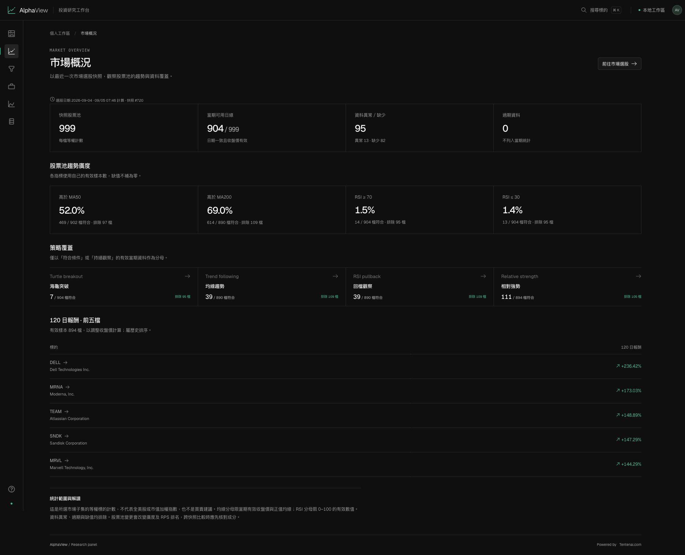

# AlphaView

**Your market, in focus.** A local-first workspace for US stock discovery, portfolio monitoring, and reproducible strategy research.

**Powered by [Tentenai.com](https://tentenai.com)** · [繁體中文使用指南](WEB_PANEL.md)

AlphaView brings market screening, transparent technical signals, and historical backtests into one focused dashboard. Your positions and research stay in a local SQLite database. Quotes are daily market data, not a real-time trading feed. Stale valuations retain their dates and show coverage warnings; unclosed future quotes and unavailable daily changes remain blank.



*Market overview captured on September 5, 2026. The screenshot shows a saved research snapshot, not live quotes or a personal portfolio.*

## What you can do

- **Discover candidates beyond your holdings.** Choose a separate candidate pool of up to 250, 500, or 1,000 liquid US-listed equities, including ADRs, retrieved in market-cap order. Requested and accepted counts are shown separately.
- **Refine and reuse screens.** Filter by RSI, relative volume, RPS, price, and signal count; sort results, save named browser presets, and export every matching row to CSV.
- **Follow daily changes.** Compare distinct stored dates; new matches, exits, missing data, and universe membership changes are labeled separately.
- **Keep a research journal.** Save local notes and tags with version checks that prevent silent overwrites. Download a consistent local backup of saved workspace data and this browser’s supported settings.
- **Understand every signal.** Inspect the rules behind Turtle breakout, moving-average trend, RSI pullback, and relative-strength screens.
- **Review historical results.** Browse the latest 60 screening dates with separate market and personal-watchlist scopes.
- **Track your own portfolio.** Manage quantities and average costs, monitor allocation and unrealized P&L, and export positions to CSV. Preview a local CSV import before atomically merging additions and updates; positions omitted from the file are kept.
- **Check concentration and co-movement.** Review current holdings over 60 or 120 sessions, with pairwise sample counts and explicit quote coverage; incomplete valuations hide weights rather than implying a complete portfolio.
- **Test a hypothesis.** Run three long-only, single-stock strategies using prior-close signals and next-open execution with configurable capital, fees and dates, transparent diagnostics, and explicit transaction costs.
- **Refresh after the close.** Opt into a local end-of-day schedule for your watchlist or a 250/500/1,000-stock market pool; monitor its last attempt from the data page.
- **Maintain local storage.** Preview table usage and superseded scan snapshots, then explicitly confirm cleanup; the latest snapshot for each scope and date is retained.
- **Inspect the data.** See quote dates, calendar-aware missing sessions, malformed OHLC, provider failures, and job progress. Retry selected symbols or cancel a job. Failed downloads preserve previously stored data; corrupt histories produce no research signals. Missing or invalid chart observations remain gaps, and incomplete daily P&L is shown as unavailable with coverage counts.

The interface is in Traditional Chinese and uses a restrained dark design, keyboard search, responsive tables, and detailed stock views.

## Local end-of-day schedule

Scheduling is **off by default**. In the data page, choose a scope and market-pool limit, enable the schedule, and save. The local server must remain running and the computer awake; this is not a cloud service. The scheduler checks approximately every 60 seconds and uses the latest XNYS session whose official close was at least 15 minutes ago, including holidays and early closes.

There is one automatic attempt per eligible session for the workspace, including failed, partially completed, cancelled, or interrupted attempts. Waking or restarting the server catches up only the latest eligible session; it does not replay every missed date. Retry failed symbols or refresh manually when needed. Disabling the schedule prevents future launches and does not cancel an active job; use the job’s cancel control separately. A busy workspace defers an unclaimed attempt until a later check. Changing the scope does not grant another automatic attempt for an already attempted session.

## Quick start

Requirements: Python **3.12**, [uv](https://docs.astral.sh/uv/), and Node.js **22.12+**.

```sh
git clone https://github.com/tentenco/AlphaView.git
cd AlphaView
uv sync --locked --extra web --extra dev
npm ci --prefix web
npm run build --prefix web
uv run --extra web python -m alphaview.panel serve
```

Open **http://127.0.0.1:8876**. In **每日選股**, choose **股票池上限** (250, 500, or 1,000), then run a market scan to download the candidate universe and daily history. Changing the selector alone does not download data or replace the current pool. Initial downloads depend on provider availability and connection speed.

An optional starter watchlist contains symbols only—no personal quantities, cost basis, or account balances:

```sh
uv run --extra web python -m alphaview.panel seed
uv run --extra web python -m alphaview.panel refresh
```

For market-wide discovery within the supported candidate pool:

```sh
uv run --extra web python -m alphaview.panel refresh --scope market --universe-limit 500
```

The CLI defaults to 250 candidates when `--universe-limit` is omitted. The option applies only to `refresh --scope market`. A targeted retry downloads only the selected symbols and retains the current pool and its configured limit.

In **資料管理 → 續跑行情更新**, choose the existing market or personal pool. Resume retains its membership and skips only successfully sourced, current, structurally valid histories with consistent metadata. Missing, stale, failed, or inconsistent histories get one download attempt each; the selected pool is then rescanned even if every history was reusable. It does not rediscover market members or change the pool limit. Full refresh and selected-symbol retry remain separate actions.

## Import your portfolio

In **我的持股**, open **匯入 CSV**, paste or select a CSV, review additions and changes, then confirm. The import stays local and never downloads prices or deletes positions omitted from the file. At most 100 rows may be imported, and the resulting personal list must remain within 100 symbols.

Required headers: `symbol,shares,cost`. Optional: `name,sector`. Symbols are normalized to uppercase. Use decimal points without currency signs or thousands separators; shares and costs must be finite numbers from 0 to 1,000,000,000. A positive share count requires a cost; a zero-share watchlist entry may leave cost blank. When optional headers are absent, existing names and sectors remain unchanged; new symbols use their code as the name and `自訂清單` as the sector.

This three-row example uses **fictional quantities and costs**, not current quotes or an actual portfolio:

```csv
symbol,shares,cost,name,sector
AAPL,2,100,Apple,Technology
MSFT,1.5,200,Microsoft,Technology
NVDA,0,,NVIDIA,Technology
```

Duplicate symbols or any invalid row block the entire import. Exported quote/computed columns are ignored with a preview warning. If holdings or the CSV change after preview, the commit is rejected; preview again to review the current changes. Database failures roll back the whole batch.

## Research methodology

| Screen | Core rule |
| --- | --- |
| Turtle breakout | Close above the prior 20-day high, an up candle, and volume confirmation |
| Trend following | Close > MA50 > MA200, with relative volume at least 1.2× |
| RSI pullback | Close above MA200, Wilder RSI(14) between 30 and 45, and an up day |
| Relative strength | Top quintile of 120-day returns within the selected same-date universe, near its 120-day high |

Indicators use dividend-adjusted daily prices. Portfolio valuation uses unadjusted daily closes and your entered holdings. Backtests use next-open execution, an initial $10,000, and a default 0.1% cost per side (configurable from 0 to 100 basis points). Cost applies symmetrically to executed notional: entry notional is available cash divided by (1 + cost rate), and exit cost is gross proceeds multiplied by the rate. This combines fees and slippage into a cost estimate without separately adjusting execution prices. Transaction amounts retain full precision; the UI formats them for display. The comparison is buy-and-hold **of the same stock** over the same period, without benchmark fees. An external SPY benchmark is not implemented; adding one requires separately validated, date-aligned adjusted data. Open positions are marked to the final close. CAGR, daily-return volatility, zero-risk-free-rate Sharpe, win rate, profit factor, and exposure include sample warnings; undefined statistics remain blank. Saved results are labeled stale when their input fingerprint or engine version changes. The current engine is `alphaview-backtest-v5`, which rejects nonfinite strategy-required metrics; older saved reports remain inspectable and are marked for recalculation.

Portfolio risk diagnostics describe **current holdings**, not historical portfolio performance. Valuation requires valid quotes for the latest completed XNYS session; incomplete coverage hides weights and concentration while labeling the available-value subtotal. Correlations use adjusted-close daily returns over 60 or 120 sessions, require at least 40 common observations per pair, and never bridge missing or invalid sessions. Stale series, zero-variance pairs, and insufficient samples remain unavailable. Pairwise date sets may differ; these results are not a covariance matrix, VaR, or a forecast.

A historical screen recomputes the current candidate universe on earlier dates; it is not a point-in-time index membership dataset and has selection/survivorship bias. Relative strength is a pool-relative ranking, not a rank across every US stock. Expanding or changing the universe can change RPS even when a stock’s price history is unchanged; compare the recorded universe as well as the signal. Research signals are not automated orders.

## Architecture

```text
alphaview/panel/    FastAPI API, market ingestion, SQLite storage, research engine
web/               React + TypeScript + Vite dashboard
tests/             Deterministic tests with isolated databases
docs/              Product research and development documentation
```

Background polling checks a lightweight workspace revision and public job state. Full overview data is fetched only after a data revision changes, on initial load, or on an explicit refresh. Transactional SQLite counters detect same-timestamp edits; active jobs poll every four seconds, visible idle pages every thirty seconds, and hidden pages pause until focus.

The repository also retains an independent optional A-share CLI in `main.py` and supporting Python modules. It is not invoked by the US-stock web panel. See [local setup](LOCAL_SETUP.md) for the separate command and configuration.

## Development

```sh
# Backend
uv run --extra web python -m alphaview.panel serve

# Frontend dev server (API proxy to port 8876)
npm run dev --prefix web

# Validation
uv run --extra web --extra dev pytest -q
npm test --prefix web
npm run format:check --prefix web
npm run build --prefix web
```

API documentation is available locally at **http://127.0.0.1:8876/docs**.

## Data and privacy

- Daily market data: Yahoo Finance through [yfinance](https://ranaroussi.github.io/yfinance/).
- Market universe: US region, Nasdaq/NYSE, USD equities; market cap ≥ $2B, price ≥ $5, three-month average daily volume ≥ 200,000; a selectable maximum of 250, 500, or 1,000 in market-cap order. Multiple share classes and ADRs may appear. This remains a filtered subset, not all US stocks.
- Discovery uses sequential pages of at most 250 results through [yfinance’s documented `offset` and `size` parameters](https://ranaroussi.github.io/yfinance/reference/api/yfinance.screen.html). A complete discovery replaces the pool and its metadata together; a page failure or cancellation before publication preserves the prior pool. Provider totals, identity filtering, and deduplication can produce fewer accepted symbols than requested. Accepted members must also report a finite numeric market cap of at least $2B; missing or malformed market caps are excluded. Multi-page responses are not an atomic market snapshot.
- Quote coverage: invalid latest closes are not replaced by older prices; missing adjacent sessions make daily changes unavailable. Portfolio value and unrealized P&L may be partial subtotals with explicit coverage warnings. Allocation weights require valid valuations for all holdings on the latest completed session; mixed-date or incomplete coverage leaves weights unavailable. Historical stock views apply current quantities and costs to the selected date’s price, not a historical holdings ledger.
- Workspace: `data/panel.db`; override with `PANEL_DB_PATH`.
- Databases, personal holdings, `.env`, logs, and local review artifacts are excluded from Git.
- The server binds to loopback. Authentication, multi-user authorization, broker execution, and public hosting are outside the current local-workspace design.
- Respect the data provider's terms and permitted usage. AlphaView does not grant redistribution rights to downloaded market data.

## Local backups

The data workspace can download a ZIP containing `alphaview.db`, `research-notes.json`, `browser-settings.json`, and `manifest.json`. The database is copied using SQLite’s online backup API from a pinned read snapshot, including committed WAL data. Notes and the manifest are derived from that same copy; normal workspace writes may continue while it is created. Only one backup is prepared at a time, with a bounded creation deadline and temporary-file cleanup.

The ZIP includes saved positions, cost basis, notes, market data, scans, backtests, job records, and validated browser screening presets/universe-limit preferences. It is **not encrypted** and stays a user-triggered local download; store it somewhere appropriate for personal financial information. Unsaved note drafts, application code, environment variables, and unrelated browser storage are excluded. The manifest records versions, table counts, and SHA-256 hashes for integrity checks.

A backup is not a restore operation. AlphaView does not automatically import the ZIP or overwrite the active database. Do not copy just a live `.db` file while WAL writes are active, and do not replace a running workspace’s files. A restore workflow remains separate work. The [read-only backup preflight CLI](docs/backup-preflight.md) validates supported ZIP structure, hashes, SQLite integrity and known schemas without restoring data; unknown schemas require separate compatibility review. CSV import covers portfolio rows only and is not a substitute for a full workspace backup.

[SQLite Online Backup API](https://www.sqlite.org/backup.html) · [Python `Connection.backup`](https://docs.python.org/3.12/library/sqlite3.html#sqlite3.Connection.backup)

## Project direction

AlphaView is developed by Tenten as a practical research workspace: discover, inspect, compare, and keep a clear record of the evidence behind a decision. Feature claims in this README describe implemented behavior; experimental work and follow-up tasks are documented separately. Read the [official-source competitor benchmark](docs/competitor-benchmark.md) and [Harness workflow](docs/HARNESS.md).

**Powered by [Tentenai.com](https://tentenai.com)**


## Storage maintenance and editing conflicts

The data page previews logical payload bytes, row counts, physical database/WAL sizes, and reusable SQLite pages. Logical payload bytes count the listed text fields in UTF-8; they are not the table’s total disk footprint. Physical file measurements can change as other work commits.

Cleanup requires a current preview and explicit confirmation. It removes only superseded scan snapshots, keeping the latest ID for every `(scope, date)`; positions, notes, bars, backtests, jobs, and scheduler attempt records stay intact. If the snapshot set changes or another data job is running, reload the preview. A local backup download is available before cleanup. There is no automatic cleanup or `VACUUM`: freed pages can be reused, so deleting rows need not shrink the file.

The portfolio editor sends `expected_updated_at` with each save and rejects conflicting edits with HTTP 409; reopen the editor to review the latest record before saving. New entries send a null expectation and also detect a concurrent addition. Legacy API clients that omit this field retain last-write-compatible behavior and do not receive this conflict protection.

Data recovery options and their validation requirements are documented in the [data-provider evaluation](docs/data-provider-evaluation.md).
